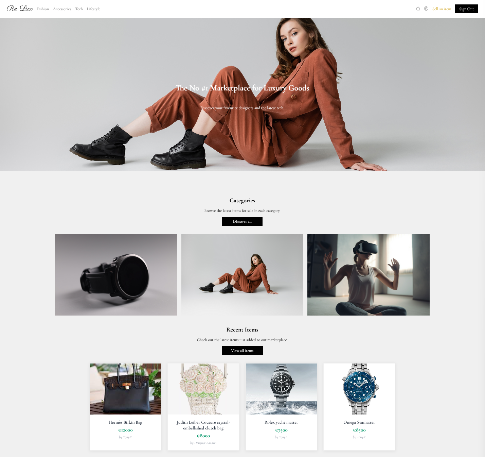

# Re-Lux - A luxury marketplace app with a sleek UI/UX design
by Katie Hill & Tony Rodriguez



*Screenshot of dynamic homepage displaying the latest listings*


## Tech stack


## Timeframe

#### Duration:
 7 days
#### Team: 
Joint project with Tony Rodriguez (TonyRod116 on GitHub)
#### Contributions: 
Developed React frontend with full CRUD operations for items, image uploads, checkout flow with Stripe integration, and UI/UX design

## About

Re-Lux is a marketplace app where users can sell a wide range of second-hand luxury goods, from designer clothing to high-end tech. It works in a similar way to other marketplace apps in that users can either make an offer on an item (which can then be accepted or rejected by the seller on their profile page) or add the item straight to their bag if they are happy to pay the asking price. 

This was an ambitious collaborative project that involved building a dynamic resale platform with multiple features. Overall, our approach worked well and we were able to deliver a fully functional app with no bugs. However, the complexity of the app threw up numerous challenges during the build.

You can view the live app here: https://re-lux-marketplace.netlify.app/


### Brief


This was a joint project with my colleague Tony Rodriguez on the General Assembly Software Engineering Bootcamp. Our brief was to build a MongoDB/Express/React/Node.js application with full CRUD that met the following criteria: 

	•	The back-end application is built with Express and Node.
	•	The front-end application is built with React.
	•	MongoDB is used as the database management system.
	•	The back-end and front-end applications implement JWT token-based authentication to sign up, sign in, and sign out users.
	•	Authorization is implemented across the front-end and back-end. Guest users (those not signed in) should not be able to create, update, or delete data in the application or access functionality allowing those actions.
	•	The project has at least two data entities in addition to the User model. At least one entity must have a relationship with the User model.
	•	The project has full CRUD functionality on both the back-end and front-end.
	•	The front-end application does not hold any secret keys. Public APIs that require secret keys must be accessed from the back-end application.
	•	The project is deployed online so that the rest of the world can use it.

## Getting started

For the frontend, clone this repository and install the following packages: 


```bash
npm install react
```

```bash
npm install react-com
```

```bash
npm install react-router
```
```bash
npm install react-router-dom
```

```bash
npm install react-icons
```
For the payment gateway:

```bash
npm install @stripe/react-stripe-js @stripe/stripe-js
```

For HTTP requests: 

```bash
npm install axios
```

```bash
npm install serverless-http
```

## Planning 


## Build

The majority of our time on this project was spent building the frontend in React. Tony and I used Vite to streamline the setup process and provide basic scaffolding for the app. We then divided the components between us to avoid working on the same features and ensure a clear separation of concerns. Tony worked on the user authentication (user context, sign up, sign in and profile pages), while I worked on the homepage, navigation bar, and item listings (index, show, create, update). For ease, we used Axios (rather than fetch requests) to consume the API:


I also created a reusable image upload component to allow users to add photos (stored on Cloudinary):


Once the basic CRUD operations were in place, we began working on additional features. I focused on the checkout flow and created individual components for this (cart page, cart summary, cart item, and checkout page). For the payment gateway, I used the React Stripe.js package and chose to use the <CardElement > to add a simple card payment form to the checkout page. To implement this, I started by creating a Cart Context and added the <CartProvider > to the root of the app:


The key here was to import the custom useCart hook from the Cart Context into the various components to maintain the cart state and allow users to add or delete items before checkout. 

I decided against calling the API using Axios in a separate /services file because I wanted to keep all the logic for the payment gateway centralised inside the checkout form:


This component sends the cart data to the /purchase-intent backend route via fetch (please see the API README for details), passing the billing details and order total to the payment gateway (the total is calculated on both the frontend and backend for safety).

The <CardElement > options and billing details have been customised, while success and error messages provide feedback to the user:


### Challenges


## Key Learnings

This project made full use of React’s capabilities (reusable components, state management, packages etc.) and allowed me to gain a thorough understanding of React frontend development.


## Future Improvements


